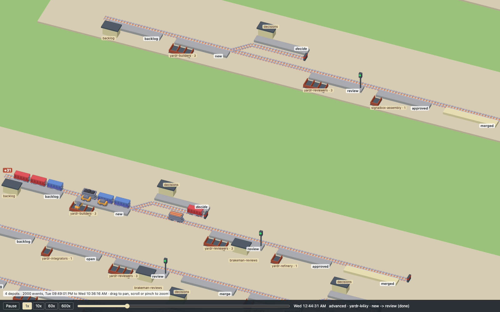

# signalbox

Watch a yardr yard as a railway. A depot is a station yard, a flow its track,
each stage a platform; a bead is a wagon that rolls on when it advances, a
train pulls its wagons, a session is a crew in a shed's bay, a review is a
signal, decide and held are sidings, a peer is a line to another yard with
mail riding as goods. The picture is drawn from the yard's structure
(`yardr --json`) and moves on its events (`yardr events --json`).

Built as a web page: TypeScript, Three.js, Vite, with Kenney's CC0 train kit.

Developed in a yardr yard; `.yardr/` holds its flow, roles and merge gate.

## Running it

    npm ci
    npm run dev        # the page, on a local port
    npm run build      # the page as static files in dist/, for any static server
    npm run check      # types
    npm test           # the tests of the layout, the replay and the motion

The page replays a day of one yard from its event log. Live events are not
there yet.

## Replaying a day

    npm run snapshot   # YARDR=/path/to/yardr to name the binary
    npm run dev

The snapshot writes `public/yard.json` (the yard now) and, beside it,
`public/events.json`: the yard's newest 2000 events (`yardr events` takes a
count and no span of time), which is the window the page plays. The page
opens at the window's start, paused. The bar at the bottom plays and pauses,
sets the speed (60x makes an hour a minute), and scrubs over the window; it
shows the yard's clock in your own time and the last event in one line.
Without `events.json` the page is the still picture of `yard.json`.

A wagon appears at the backlog when its bead is made, rolls to the next
platform when it advances (into a siding over the points, back along the
return line), and past the buffer when it reaches the flow's last stage. A
session is a crew that leaves its bay for the platform beside its wagon and
goes back when the session ends. A held bead stands in the siding. A peer's
message is a goods wagon on the peer's line, a hook a flash of the wire.

## Where things are

- `scripts/snapshot.sh` writes `public/yard.json` and `public/events.json`
  from the yard's own commands (`npm run snapshot`, with `YARDR=` to name the
  binary). The committed files are the demo data and the tests' fixture: the
  tests name the yard's depots, groups and beads, so a new snapshot may need
  them brought along. Of an event the file keeps its number, time, kind and
  bead, and a few names from its data; a session is an alias (`s1`, `s2`).
- `public/layout.json` is the layout's memory: the slot of every depot, flow,
  stage and peer drawn so far. The snapshot script writes it when it is
  missing and adds what is new to it otherwise (`scripts/slots.mjs`); the page
  only reads it. Delete it to have the yard laid out afresh.
- `src/yard.ts`: the shape of the snapshot.
- `src/layout.ts`: from the structure to positions, one pure function. A
  flow's stages stand in the order a bead travels them, its terminal stage
  last; an element with a slot in `layout.json` keeps it, so a yard that grows
  or is listed in another order keeps what it had where it was. The mapping
  from yard to railway is decided here.
- `src/kit.ts`: the models, behind `loadKit`. Kenney's Train Kit
  (`public/kit/`, CC0, with its licence) has the rails, wagons and locomotives;
  platforms, sheds, signals and signal boxes are boxes in six colours.
- `src/replay.ts`: the yard at a moment of the window, one pure reducer over
  the events: `state(yard, log, n)` is the open beads after the first `n`.
  The window's start is read off the window itself: a bead made in it is not
  there yet, any other stands where its first advance left.
- `src/player.ts`: the replay's clock and speed. `src/motion.ts`: the way a
  wagon takes between two places, and how long it takes (a second at most,
  at any speed).
- `src/scene.ts` draws a layout: `draw` what stands still, `Stock` the wagons
  and crews, which it moves from one state to the next. `src/main.ts` is the
  page: camera, pan and zoom, labels, the bead under the pointer, the bar.
