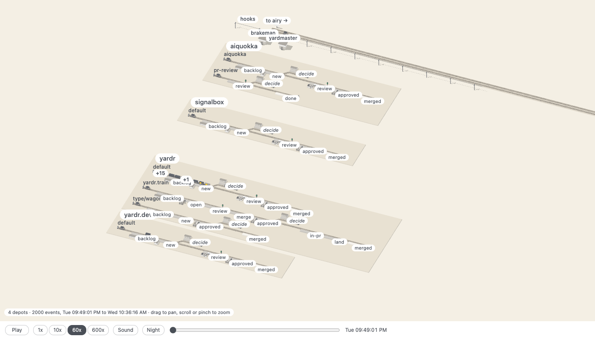

# signalbox

Watch a yardr yard as a railway. A depot is a station yard, a flow its track,
each stage a platform; a bead is a wagon that the track's shunter takes on
when it advances, a train is a row of coupled wagons, a session is a figure
who walks out of its group's hut to work on its wagon, a review is a signal,
decide and held are sidings, a peer is a line to another yard with mail
riding as goods. The picture is drawn from the yard's structure and moves on
its events, both read from the yard's web view (`yardr web serve`): its JSON
and its stream.

Built as a web page: TypeScript, Three.js, Vite, with Kenney's CC0 kits: the
Train Kit, City Kit Industrial and Mini Characters.

Developed in a yardr yard; `.yardr/` holds its flow, roles and merge gate.

## Running it

    npm ci
    npm run dev        # the page, on a local port
    npm run build      # the page as static files in dist/, for any static server
    npm run live       # the page following the yard this machine runs
    npm run check      # types
    npm test           # the tests of the layout, the replay, the motion, the shunters, the scene, the serve script and the release script
    npm run release -- v1.2.3   # the release archive of that tag, in release/

The page replays a day of one yard from its event log, and follows a yard as
it runs when the serve script serves it.

## Following a yard as it runs

`npm run live` builds the page and starts `scripts/serve.mjs`, which follows
the yard through its web view. [INSTALL.md](INSTALL.md) says how to install
it beside a yard and how to put it before the public.

## Replaying a day

The page replays a day of one yard from its event log. `npm run snapshot`
writes `public/yard.json` and the newest 2000 events in
`public/events.json`; the page opens at the window's start, paused. What
moves and what a fault looks like are in
[docs/replay.md](docs/replay.md).

## Where things are

Three pages have the reference: [docs/look.md](docs/look.md) the colours and
the light picture, [docs/replay.md](docs/replay.md) the replay and the live
page, [docs/code.md](docs/code.md) each of these files at length.

- `scripts/snapshot.sh`: writes the snapshot from the yard's web view (`npm run snapshot`).
- `scripts/snapshot.mjs`: writes `yard.json`, `events.json` and `quota.json` for it.
- `scripts/slots.mjs`: writes the layout's memory beside a snapshot.
- `scripts/yard.mjs`: asks the view, and runs `aiquokka`, for the snapshot and the serve script alike.
- `scripts/serve.mjs`: serves `dist/` and the routes a page follows a yard by (`npm run live`).
- `scripts/release.sh`: builds a release (`npm run release -- v1.2.3`, the tag).
- `public/yard.json`, `public/events.json`: the committed snapshot, the demo data and the tests' fixture.
- `public/layout.json`: the layout's memory for the committed snapshot.
- `public/kit/`: the models, each pack's subset with its licence.
- `src/yard.ts`: the shape of the snapshot, and of `quota.json`.
- `src/project.ts`: the one place that decides which fields are passed on.
- `src/layout.ts`: from the structure to positions, one pure function.
- `src/kit.ts`: the models, behind `loadKit`.
- `src/palette.ts`: every colour of the picture.
- `src/replay.ts`: the yard at a moment of the window, one pure reducer over the events.
- `src/player.ts`: the replay's clock and speed, and, live, a window that grows at its end.
- `src/motion.ts`: the way a wagon takes between two places, and a figure's.
- `src/shunt.ts`: the shunters, pure as `motion.ts` is.
- `src/sound.ts`: which sound an event is, and the three sounds.
- `src/scene.ts`: draws a layout, and moves the wagons and figures from one state to the next.
- `src/canvas.ts`: the canvas, and the light picture a browser gets that refuses the full one.
- `src/card.ts`: builds the text of a bead's card, pure.
- `src/fault.ts`: reports the live page's faults to the script's log.
- `src/main.ts`: the page: camera, pan and zoom, labels, the card, the bar.
- `test/`: the tests, one file for each of these it tests.

## Licence

Apache 2.0 ([LICENSE](LICENSE), [NOTICE](NOTICE)). The kits are Kenney's,
CC0, each with its licence in `public/kit/`.
