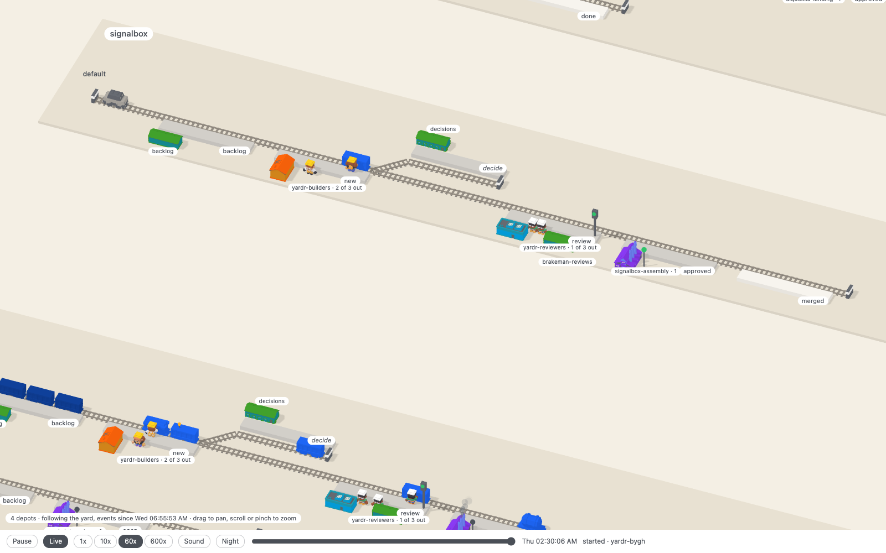

# signalbox

Watch a yardr yard as a railway. A depot is a station yard, a flow its track,
each stage a platform; a bead is a wagon that the track's shunter takes on
when it advances, a train is a row of coupled wagons, a session is a figure who walks out of its group's
hut to work on its wagon, a review is a signal, decide and held are sidings, a peer is a line to another yard with
mail riding as goods. The picture is drawn from the yard's structure
(`yardr --json`) and moves on its events (`yardr events --json`).

Built as a web page: TypeScript, Three.js, Vite, with Kenney's CC0 kits: the
Train Kit, City Kit Industrial and Mini Characters.

Developed in a yardr yard; `.yardr/` holds its flow, roles and merge gate.

## Running it

    npm ci
    npm run dev        # the page, on a local port
    npm run build      # the page as static files in dist/, for any static server
    npm run live       # the page following the yard this machine runs
    npm run check      # types
    npm test           # the tests of the layout, the replay, the motion, the shunters, the scene and the serve script

The page replays a day of one yard from its event log, and follows a yard as
it runs when the serve script serves it.

## Replaying a day

    npm run snapshot   # YARDR=/path/to/yardr to name the binary
    npm run dev

The snapshot writes `public/yard.json` (the yard now) and, beside it,
`public/events.json`: the yard's newest 2000 events (`yardr events` takes a
count and no span of time), which is the window the page plays. The page
opens at the window's start, paused. The bar at the bottom plays and pauses,
sets the speed (60x makes an hour a minute), and scrubs over the window; it
shows the yard's clock in your own time and the last event in one line.
Without `events.json` the page is the still picture of `yard.json`.

A wagon appears at the backlog when its bead is made. It does not move by
itself. Every track has a shunter, the kit's diesel, parked on a headshunt
before the first platform. When a bead advances the shunter runs to its
wagon, couples, and pulls it to the next platform, into a siding over the
points, back along the return line, or out past the buffer when the bead
reached the flow's last stage. Then it runs home, or straight to the next
wagon if one waits. The shunter is always before the wagon the way they go.
It is on the rail where that is free and beside it on the return line where
a wagon stands or the rail ends, and where the way turns back (out of a
siding and on up the line) it runs round the wagon. It is never turned
round, and it is never drawn on a wagon. A job is about three seconds at
1x, a second at 10x and more. A shunter takes three jobs in order. With
more than three before it, and on a scrub, the wagons stand at once where
the state has them and the shunter is parked. A train moves as one job, its
wagons coupled. Wagons behind the one that left close up when it has been
pulled away. A figure works on a wagon only once it stands. A
group has a building beside a platform it is routed to: people a station, a
group whose sessions are scripts a works, at each of their platforms. A
group that runs sessions in panes is a crew, and has one building on each
board it is routed to, at the first of its platforms there: builders a site
hut and yellow hard hats, reviewers an office and white ones. A figure
walks from its own board's building and back, never from one board to
another. Every building has its door to
its platform; a crew stand idle in a row from the door's corner down the
line, where the building does not hide them from the reader, a place for
each session the group may run, and the sign
counts who is out (`yardr-builders · 1 of 3 out`), so an empty place is a
session at work. The count is the group's in the whole yard, and each of
its buildings shows it: with one of three out, two stand idle before every
door of the group, and the third is at its wagon on its own board. When a session starts, the first figure at home walks over
the ground to the platform its bead stands at (a second or two at 1x,
however far; a faster replay walks as much faster, down to a wagon's least
0.3 s), turns to the wagon and works on it at its own pace, whatever the
replay's, and says under the pointer which bead and group; when the session
ends it walks back, unless it ended badly (below). A scrub puts everyone
where they were then, at once. With `prefers-reduced-motion` the figures
stand still where they are, a hand at the wagon. A building says under the
pointer its group, runner and limit. A click on a wagon, or on the figure at
work on it, opens the bead's card at the right of the page: its id and
title, depot, type, stage, group and whether a session is on it, hold,
priority, labels, when it was created and last changed, then its body and
its notes, newest first, each as plain text. Another wagon replaces the
card, a click anywhere else in the yard or Escape closes it, and the camera
stays where it is. The body and the notes are asked of the yard at the
click, so only the live page has them: the replay's card is what the
snapshot holds, and says "notes need the live page". The yard's crew members stand before
their signal boxes. A held bead stands in the siding. A peer's
message is a goods wagon on the peer's line, named by its kind and its peer:
out from the yard's end past the edge of the yard, or in from there, a few
seconds either way, each on its own rail. Goods are pulled too. The line has
a shunter of its own for goods out, parked at the yard's end, and goods in
come behind an engine of the peer's, which goes home when they have gone.
One train runs each way at a time, and the next waits out of sight. A hook
is a flash of the wire.

What went wrong is drawn too, and says under the pointer what and when
("held", "session stalled 14:02", "move refused 06:27"):

- A held wagon has chocks at its wheels and a small red flag, until it is
  let go.
- A session that came to no good end leaves its figure at the wagon: sat on
  the platform with its back to it, hat off. That is `session_stalled`,
  `session_blocked`, `session_harness_error`, `session_prompt_gave_up`,
  `session_died`, `gave_up`, and an advance with another outcome than done,
  where the figure goes with the wagon and sits where it arrives. It is not
  out: the sign counts sessions at work, and the hut has its places for
  them, so a sat figure is one more than those. The next session on the
  bead stands it up (as does `session_unblocked` a blocked one); when the
  bead moves on without it, it goes.
- `move_refused` and `stranded` are a lamp on the wagon, flashing red until
  the bead moves or closes; so is a session's bad end where no crew has a
  figure to sit for it, a script's failed landing for one. `unrouted` is the
  same lamp on the platform the bead sits at. With `prefers-reduced-motion`
  the lamps are lit and still.

The snapshot has one `fault` on a bead for all of these but the hold: a kind
and a time. The replay sets and clears it from the window's events; the
snapshot itself knows only how a bead's last session ended (died, failed,
aborted), since a stalled or blocked session is still running to the yard.
So a fault older than the window is seen only if it is of that kind.

## Following a yard as it runs

    npm run live                          # YARDR=/path/to/yardr, YARDR_HOME=/a/yard as for the snapshot
    npm run live -- --interval 1          # seconds between two looks at the yard (3)
    npm run live -- --port 8800           # a port of your choice (a free one)
    npm run live -- --host 100.64.0.7     # an address other than this machine's own

`npm run live` builds the page and starts `scripts/serve.mjs`, which prints
the page's address: on 127.0.0.1 and a free port unless told otherwise. The
page opens at now, playing: the yard as it stands, and every few seconds what
happened since, moved as the replay moves it. The bar shows `Live` and the
yard's clock. Scrub back and it is the replay of the window so far (the
yard's newest 2000 events), at the speed you set; `Live` returns to now.
When the yard gets a new depot, flow, peer or crew, or a bead the page has
not seen, the page takes a new snapshot and lays out again: what was placed
stays where it was.

The script asks the yard through its own commands and nothing else, the ones
the snapshot uses, every interval while a page listens. It is three routes
beside the files of `dist/`:

- `GET /api/snapshot`: `yard.json`, `layout.json` and `events.json` in one
  answer, taken now.
- `GET /api/feed?after=<seq>`: server-sent events, one message for each event
  of the yard after `seq`, with its number as the id. A page that lost the
  line says where it was (`Last-Event-ID`) and misses nothing, also when the
  script was restarted in between. Restart it on the same `--port`: a free
  port is another one each time, and the open page looks for the old one.
- `GET /api/bead/<id>`: one bead for its card, `{bead, notes}`, asked of the
  yard at the click (`yardr prime --bead <id> --json`, which only reads:
  `yardr bead show` prints no notes). An id is lower-case letters, figures,
  dots and dashes, and starts with a letter or a figure; anything else is
  refused before a command is run. A bead the yard does not have is a 404,
  and the card says "not found".

What it exposes: what the committed snapshot holds, for the yard as it is
now. Depots, flows, stages, groups, routes, crew and peers by name; of each
open bead its id, title, type, stage, labels, whether a session works it and
what went wrong with it last (a kind and a time);
of each event its number, time, kind, bead and a few names (group, depot,
peer, stages of an advance). And of the one bead a card asks for, live
only and in no file: its body and its notes, each with its author and time,
as they were written. Whoever writes a path or a key into a note has put it
on the card. Never a path or a key the yard itself prints, nor a session's
own name: `src/project.ts` builds each answer from the fields it names. There is no login, as with `yardr web serve --unsafe`: whoever reaches
the port reads all of that. So it listens on this machine alone, and
`--host` is for an address only your own devices reach, such as this
machine's on a Tailscale net, for a phone on the same net.

Without the script (`npm run dev`, or `dist/` on any static server) nothing
of this is there, and the page is the committed snapshot and its replay.

## Where things are

- `scripts/snapshot.sh` writes `public/yard.json` and `public/events.json`
  from the yard's own commands (`npm run snapshot`, with `YARDR=` to name the
  binary). The committed files are the demo data and the tests' fixture: the
  tests name the yard's depots, groups and beads, so a new snapshot may need
  them brought along. Of an event the file keeps its number, time, kind and
  bead, and a few names from its data; a session is an alias.
- `scripts/yard.mjs` runs those commands, for the snapshot and the serve
  script alike, and `src/project.ts` cuts what they print down to what the
  page reads: the one place that decides which fields are passed on.
- `scripts/serve.mjs` serves `dist/` and the two routes a page follows a
  yard by (`npm run live`). It keeps nothing but the slots it has given.
- `public/layout.json` is the layout's memory: the slot of every depot, flow,
  stage and peer drawn so far. The snapshot script writes it when it is
  missing and adds what is new to it otherwise (`scripts/slots.mjs`); the page
  only reads it. Delete it to have the yard laid out afresh.
- `src/yard.ts`: the shape of the snapshot.
- `src/layout.ts`: from the structure to positions, one pure function. A
  flow's stages stand in the order a bead travels them, its terminal stage
  last; an element with a slot in `layout.json` keeps it, so a yard that grows
  or is listed in another order keeps what it had where it was. The mapping
  from yard to railway is decided here.
- `src/kit.ts`: the models, behind `loadKit`, all Kenney's and CC0, each
  pack's subset with its licence in `public/kit/`: the Train Kit (rails,
  wagons, locomotives), City Kit Industrial in `city/` (the hut is
  `building-i`, the office `building-p`, the works `building-m`, the station
  `building-s`) and Mini Characters in `people/` (builders `character-male-e`
  and `character-female-f`, reviewers `character-male-a`, crew members
  `character-male-c`; the clips `idle`, `walk` and, for work,
  `interact-right`). A hard hat is two boxes on the head bone. A model that
  does not load is a box, a figure two. Platforms, signals and signal boxes
  are boxes in six colours. The kit's diesel is the shunter.
- `src/replay.ts`: the yard at a moment of the window, one pure reducer over
  the events: `state(yard, log, n)` is the open beads after the first `n`.
  The window's start is read off the window itself: a bead made in it is not
  there yet, any other stands where its first advance left.
  A feed's event goes through the same reducer; `outgrown` says when one
  names what the snapshot does not hold, and the page takes a new one.
- `src/player.ts`: the replay's clock and speed, and, live, a window that
  grows at its end. `src/motion.ts`: the way a wagon takes between two
  places, and how long it takes (a second at most, at any speed; a peer's goods four at
1x and never under two), a figure's way between its place and its wagon, how
  long it takes at a speed of the replay, and what it does there.
- `src/shunt.ts`: the shunters, pure as `motion.ts` is. An engine is
  transport and no part of the yard's state. An order is the wagons that go
  together, a job the shunter's ways for it (fetch, pull, release, return),
  `Shunter` the queue of one engine. The planner checks each way of the
  shunter against the wagons that stand, and takes the return line where the
  rail would put it on one.
- `src/scene.ts` draws a layout: `draw` what stands still, `Stock` the wagons
  and figures, which it moves from one state to the next, each figure with a
  mixer of its own: one clip at a time, faded into the next. `src/main.ts` is the
  page: camera, pan and zoom, labels, the bead under the pointer, the card
  of the bead that was clicked, the bar. `src/card.ts` builds the card's
  text, pure: from the yard's answer, or from the snapshot's bead alone.
