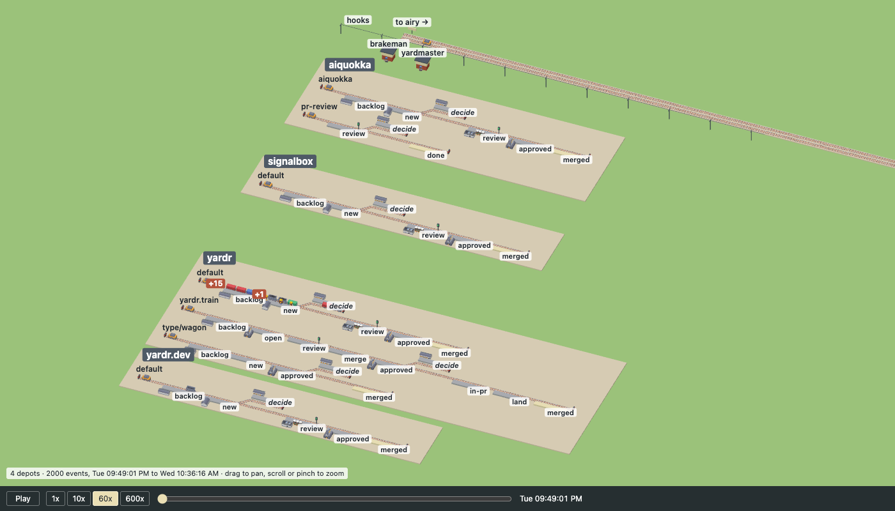
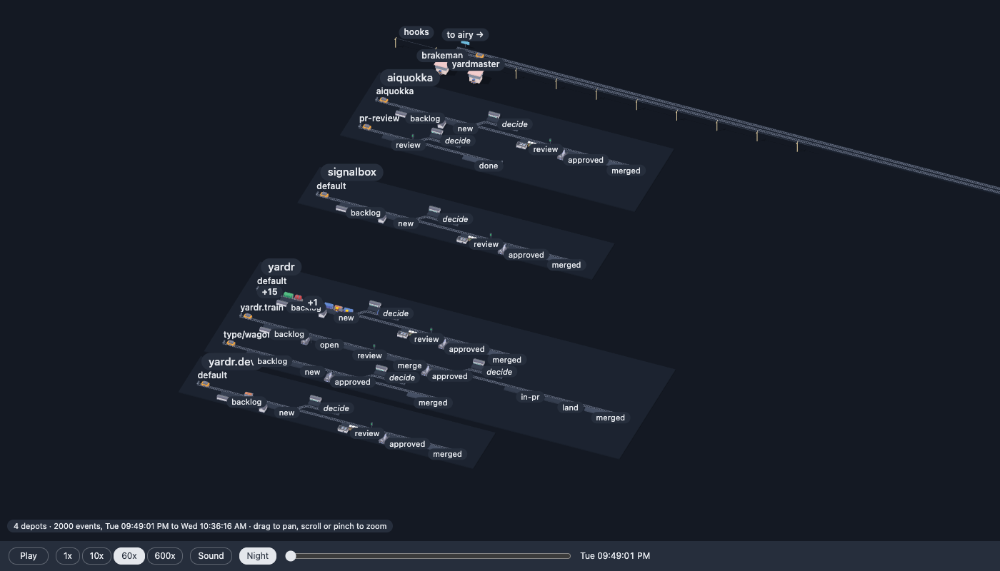
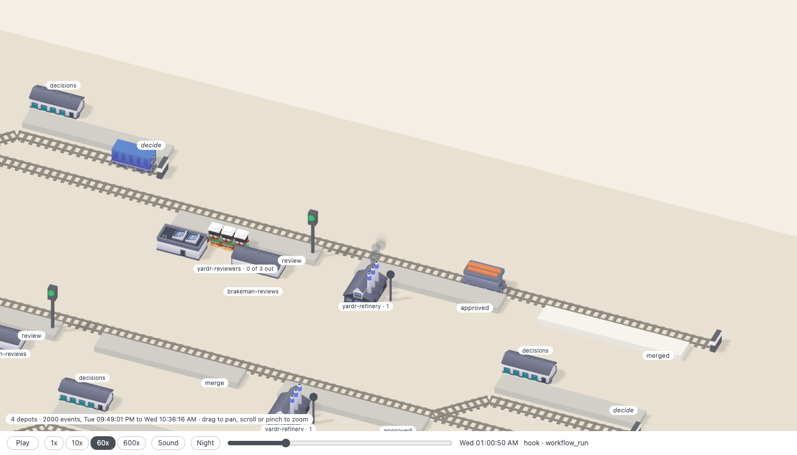
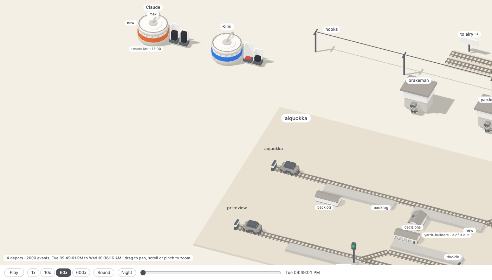

# signalbox

Watch a yardr yard as a railway. A depot is a station yard, a flow its track,
each stage a platform; a bead is a wagon that the track's shunter takes on
when it advances, a train is a row of coupled wagons, a session is a figure who walks out of its group's
hut to work on its wagon, a review is a signal, decide and held are sidings, a peer is a line to another yard with
mail riding as goods. The picture is drawn from the yard's structure and
moves on its events, both read from the yard's web view (`yardr web serve`):
its JSON and its stream.

Built as a web page: TypeScript, Three.js, Vite, with Kenney's CC0 kits: the
Train Kit, City Kit Industrial and Mini Characters.

Developed in a yardr yard; `.yardr/` holds its flow, roles and merge gate.

## Running it

    npm ci
    npm run dev        # the page, on a local port
    npm run build      # the page as static files in dist/, for any static server
    npm run live       # the page following the yard this machine runs
    npm run check      # types
    npm test           # the tests of the layout, the replay, the motion, the shunters, the scene and the serve script

The page replays a day of one yard from its event log, and follows a yard as
it runs when the serve script serves it.

## Look

The ground and the labels are in the manner of Mini Motorways (Dinosaur
Polo Club, https://dinopoloclub.com/games/mini-motorways/): a cream ground
with nothing behind it, the depots as pads a little darker, a track as a warm
grey ribbon, thin labels on white pills, one sun and one soft shadow. On that
stand the kit's own models, in the texture the packs paint them from: their
iron, white, glass and dark as they came. Only where a pack had painted a
face in a colour does one of Catppuccin's accents
(https://github.com/catppuccin/palette) go instead.

What a colour of the kit's is, is one rule (`COLOUR` in `src/kit.ts`): the
saturation of the texture where the face lies on it, over 0.45. The packs'
texture is swatches, and they lie well apart on that: white, the irons, the
darks, the pale glass and the creams are 0.38 at most, and the reds, oranges,
yellow, green, blues, purple and pink 0.48 at least. So do the browns of
wood and brick: no saturation parts them from a blue, and a wagon's load of
logs is painted as a container's box is. A test reads both textures and
names the swatches on each side.

A building has its kind's two accents. The lightest of the colours the pack
gave it goes in the first, its walls', and any colour of another hue in the
second, its roof's. The pack's buildings are iron and white with a little
yellow, so that is a trim: the row of doors in a station's front in teal, a
works' doors and the bands of its chimneys in lavender, a hut's door in
yellow and an office's in sky, and the bush that stands by each of those two
in peach and in sapphire. A silo has no colour but its band, which is
its provider's. The scene's own buildings, which are boxes, are their accents
all over: a signal box, the telegraph's poles, a peer's board. The colour
says nothing: a hut is a hut's in every depot.

| building | walls | roof |
| --- | --- | --- |
| a people's station | teal | green |
| a builders' hut | yellow | peach |
| a reviewers' office | sky | sapphire |
| a works | lavender | mauve |
| a signal box | rosewater | flamingo |
| a silo | pink | pink |
| the telegraph's poles | yellow | yellow |
| a peer's board | sapphire | sapphire |

A wagon is one accent by the type of its bead, the same across the yard, so
a train's wagons are told from tasks at a glance: a task blue, a train's
locomotive mauve, a wagon teal, a memory lavender, any other type sky. It is
on the faces the pack had coloured: a container's box, a tank's barrel, a
load of logs, and of a locomotive its boiler and cab, its buffer beams and
its driving wheels; frames, a wagon's wheels and a tank's bands stay iron. A bead rides only in the kinds that have such a face. They
are the blues and purples because those are the accents a red or amber lamp,
a red flag, orange chocks and green moss read on, fresh, dull and rusted: a
test measures it (`test/scene.test.ts`, the distance in Oklab), and a warm
accent or pink fails it. A shunter and a peer's goods carry no bead and stay
grey: the shunter's body, the pack's yellow, is overlay, and goods ride in
the two kinds the pack left iron all over, the box van and the coal wagon.
Red and maroon are no building's and no wagon's: red is a fault's and a stop
lamp's.

The people are the kit's own, in its texture as it came; a hard hat is ours,
hi-vis yellow for a builder and white for a reviewer.

`src/palette.ts` is the one place that names a colour of the picture, the
labels' ink and pill too. Its tones are the greys and creams of the ground,
the track and the platforms, one set by day and one by night. Its accents are
Latte's by day and Mocha's by night under the same names, so what is mauve is
mauve in both. A lamp, a fault and the weather are the same in both, and so
is the kit's texture: it is lit as the people are and not recoloured. Night is
the same picture on a near-black blue with the labels turned round. The page takes it when the
reader's system is dark; Night on the bar says otherwise, and the browser
remembers that until it is what the system says anyway. The camera looks down
at an angle and is orthographic, as it was: nothing grows smaller with
distance, so the yard reads as a map.

Before the ground went flat (the old page used the same picture in both
system settings):

Now, by day:

## Replaying a day

    npm run snapshot   # YARDR_WEB=http://127.0.0.1:8791 names the yard's web view
    npm run dev

The snapshot writes `public/yard.json` (the yard now) and, beside it,
`public/events.json`: the events of the yard's newest 2000 sequence numbers
(the view's stream starts after a number, not at a time), which is the
window the page plays. The page
opens at the window's start, paused. The bar at the bottom plays and pauses,
sets the speed (60x makes an hour a minute), and scrubs over the window; it
shows the yard's clock in your own time and the last event in one line.
Without `events.json` the page is the still picture of `yard.json`.

Sound on the bar turns the yard's sounds on, and the browser remembers it:
a whistle when a bead lands (closed as merged), a bell when a session
stalls or is given up, a clank when a shunter takes wagons on and when it
lets go of them. They are off until then, and a scrub is silent: only what
happens while the replay plays, or the yard runs, is heard.

A wagon appears at the backlog when its bead is made. It does not move by
itself. Every track has a shunter, the kit's diesel, parked on a headshunt
before the first platform. When a bead advances the shunter runs to its
wagon, couples, and pulls it to the next platform, into a siding over the
points, back along the return line, or out past the buffer when the bead
reached the flow's last stage. Then it runs home, or straight to the next
wagon if one waits. The shunter is always before the wagon the way they go.
It is on the rail where that is free and beside it on the return line where
a wagon stands or the rail ends, and where the way turns back (out of a
siding and on up the line) it runs round the wagon. It is never turned
round, and it is never drawn on a wagon. A job is about three seconds at
1x, a second at 10x and more. A shunter takes three jobs in order. With
more than three before it, and on a scrub, the wagons stand at once where
the state has them and the shunter is parked. A train moves as one job, its
wagons coupled. Wagons behind the one that left close up when it has been
pulled away. A figure works on a wagon only once it stands. A
group has a building beside a platform it is routed to: people a station, a
group whose sessions are scripts a works, at each of their platforms. A
group that runs sessions in panes is a crew, and has one building on each
board it is routed to, at the first of its platforms there: builders a site
hut and yellow hard hats, reviewers an office and white ones. A figure
walks from its own board's building and back, never from one board to
another. Every building has its door to
its platform; a crew stand idle in a row from the door's corner down the
line, where the building does not hide them from the reader, a place for
each session the group may run, and the sign
counts who is out (`yardr-builders · 1 of 3 out`), so an empty place is a
session at work. The count is the group's in the whole yard, and each of
its buildings shows it: with one of three out, two stand idle before every
door of the group, and the third is at its wagon on its own board. When a session starts, the first figure at home walks over
the ground to the platform its bead stands at (a second or two at 1x,
however far; a faster replay walks as much faster, down to a wagon's least
0.3 s), turns to the wagon and works on it at its own pace, whatever the
replay's, and says under the pointer which bead and group; when the session
ends it walks back, unless it ended badly (below). A scrub puts everyone
where they were then, at once. With `prefers-reduced-motion` the figures
stand still where they are, a hand at the wagon. A building says under the
pointer its group, runner and limit. A click on a wagon, or on the figure at
work on it, opens the bead's card at the right of the page: its id and
title, depot, type, stage, group and whether a session is on it, hold,
priority, labels, when it was created and last changed, then its body and
its notes, newest first, each as plain text. Another wagon replaces the
card, a click anywhere else in the yard or Escape closes it, and the camera
stays where it is. The body and the notes are asked of the yard at the
click, so only the live page has them: the replay's card is what the
snapshot holds, and says "notes need the live page". The yard's crew members stand before
their signal boxes. A held bead stands in the siding. A peer's
message is a goods wagon on the peer's line, named by its kind and its peer:
out from the yard's end past the edge of the yard, or in from there, a few
seconds either way, each on its own rail. Goods are pulled too. The line has
a shunter of its own for goods out, parked at the yard's end, and goods in
come behind an engine of the peer's, which goes home when they have gone.
One train runs each way at a time, and the next waits out of sight. A hook
is a flash of the wire.

What went wrong is drawn too, and says under the pointer what and when
("held", "session stalled 14:02", "move refused 06:27"):

- A held wagon has chocks at its wheels and a small red flag, until it is
  let go.
- A session that came to no good end leaves its figure at the wagon: sat on
  the platform with its back to it, hat off. That is `session_stalled`,
  `session_blocked`, `session_harness_error`, `session_prompt_gave_up`,
  `session_died`, `gave_up`, and an advance with another outcome than done,
  where the figure goes with the wagon and sits where it arrives. It is not
  out: the sign counts sessions at work, and the hut has its places for
  them, so a sat figure is one more than those. The next session on the
  bead stands it up (as does `session_unblocked` a blocked one); when the
  bead moves on without it, it goes.
- `move_refused` and `stranded` are a lamp on the wagon, flashing red until
  the bead moves or closes; so is a session's bad end where no crew has a
  figure to sit for it, a script's failed landing for one. `unrouted` is the
  same lamp on the platform the bead sits at. With `prefers-reduced-motion`
  the lamps are lit and still.

The snapshot has one `fault` on a bead for all of these but the hold: a kind
and a time. The replay sets and clears it from the window's events; the
snapshot itself knows only how a bead's last session ended (died, failed,
aborted), since a stalled or blocked session is still running to the yard.
So a fault older than the window is seen only if it is of that kind.

A works smokes while it runs. A session that starts on a bead at a stage
routed to a group of scripts (the assembly, the refinery: `started`) is a
run of the depot's gate and the merge: a few grey puffs rise from the works'
chimney and thin out, at their own pace whatever the replay's speed. The
lamp on the post beside the works says how the last run ended: green for a
landing (the advance past the buffer, or a close as merged), red for a gate
that failed (an advance with the outcome failed), and it stays so until the
next run starts, which puts it out. Any other end (a hold, a session that
died, a bead taken back) stops the smoke and leaves the lamp as it was.
A scrub snaps: the whole plume if a run is open at that time, and the lamp
of the last run before it. Under the pointer the works says which bead it
runs the gate on and since when, or how its last run ended. The snapshot
knows of no run, so a still picture has every lamp out; a window that begins
in a run has it open. With `prefers-reduced-motion` the plume stands.

What the yard burns is drawn as coal. Every provider whose agents the yard
uses (the `kind` of a group that starts sessions, and of a crew member:
claude, codex, kimi) has a silo in the signal boxes' row, at their pitch, to
the left of the first box, with the provider over it and its plan. The first
stands a pitch left of the telegraph's first post, so that the post's sign,
"hooks", lies over no silo's name. The silo
is the kit's large tank, and the band round it is the provider's colour:

| provider | band |
| --- | --- |
| `claude` | peach, for Claude's orange |
| `codex` | green, for OpenAI's |
| `kimi` | blue |
| any other | overlay, Catppuccin's grey |

The table is `livery` in `src/palette.ts`, by the provider's key; the colours
are Catppuccin's accents of those names, as the day or the night has them, on
a pink silo. What is left
stands outside the silo, in two indicators to its right: the coal in the
first is what is left of the provider's weekly quota, 100 less the percent
used; the second, lower one is the five-hour window the same way. Under 20
percent left the fill is amber, under 5 red. The sign under the silo is the
next delivery, when the week starts again in your own time ("resets Mon
15:00"); a silo whose week is used up says "out" before it. A silo whose
level nobody knows (no `aiquokka` on the machine, or a provider it does not
list) has empty indicators and says "unknown". Under the pointer a silo says
both windows in figures. From far out the plan and the sign are hidden, but
for "out" and "unknown": the band says which provider, the indicators how
much is left. The levels come from `aiquokka --json`, and there is no
history of them: a replay shows the silos as they were when the snapshot
was taken, marked "now", whatever time the bar stands at, and a snapshot
without `quota.json` has no silos. Groups of people and of scripts burn
nothing and have none.

A wagon that waits on a person weathers. At a stage only a person moves a
bead on from (backlog, decide: the flow's `human` stages) its paint is dull
after three days, rusted after a week, and moss grows on its top after two;
under the pointer it says how long ("in backlog 9 days"). A wagon at any
other stage waits on the yard and stays clean, however old. The age counts
from the bead's last advance, and is as of the replay's clock, so a wagon
weathers as the bar is scrubbed forward and is fresh again when it moves.
The snapshot knows a bead's last advance (`moved_at`) only from the window
of the log: a bead that moved before it counts from when it was created.

A wagon that waits for another has a lamp naming it; couplings are trains.
Only a `blocks` edge is a wait (a `parent` is the train's coupling, a
`discovered-from` is history), and only while its blocker is open: a wagon
whose blocker has closed waits for nothing, though it may still stand in
backlog.

The lamp is small and amber, over the wagon's roof, lit and still until the
blocker closes. It is the same lamp wherever the blocker stands: at the
same platform, at another one of the board, on another board, or only
counted at its platform. Nothing is drawn between the two: coupled wagons
move together, and a wagon does not follow its blocker.

Under the pointer the wagon says what it waits for ("waits for yardr-xyz
(aiquokka · review)": the bead, the board it is on and its stage there), a
line for each blocker. The snapshot has the edges as `edges` in
`yard.json`: of every edge of the yard (the view's `/deps`) the ones with
an open bead at an end. The replay keeps them from
`dep_added` and `dep_removed`, and drops a bead's edges when it closes.

## Following a yard as it runs

    npm run live                          # the yard whose web view is at http://127.0.0.1:8791
    YARDR_WEB=http://127.0.0.1:9000 npm run live   # a view at another address, as for the snapshot
    npm run live -- --port 8800           # a port of your choice (a free one)
    npm run live -- --host 100.64.0.7     # an address other than this machine's own

`npm run live` builds the page and starts `scripts/serve.mjs`, which prints
the page's address: on 127.0.0.1 and a free port unless told otherwise. The
page opens at now, playing: the yard as it stands, and what happens in it as
it happens, moved as the replay moves it. The bar shows `Live` and the
yard's clock. Scrub back and it is the replay of the window so far (the
events of the yard's newest 2000 sequence numbers), at the speed you set; `Live` returns to now.
When the yard gets a new depot, flow, peer or crew, or a bead the page has
not seen, the page takes a new snapshot and lays out again: what was placed
stays where it was, also when the script is started again: it keeps the
yard's slots in the yard's home (`$YARDR_HOME/signalbox/layout.json`).

The script follows the yard through its web view and nothing else: it is
one more reader of `yardr web serve`, as a browser on the view is, and
starts no process of yardr's. So the view has to run (`yardr web serve`, or
`yardr web start` or `yardr web install` to keep it running; this yard's
runs already, on 8791). A view on loopback is enough, also for a page
served to another device with `--host`: the script is on the view's machine
and is the one that asks. `YARDR_WEB` names a view at another address. What the yard
is now the script reads as JSON, a route of the view for each list
(`/depots`, `/flows`, `/groups`, `/routes`, `/crew`, `/peers`, `/beads`,
`/sessions`, `/deps`); what happens in it comes on the view's stream
(`/events?format=json`), which the script holds open once, for all pages,
while one listens. A view that is stopped and started again loses a page
nothing: the script asks again every second, after the last event it
passed on, and what happened in between comes first. The same holds for a
restart of the yardr server, which the view rides out inside the stream.
The page's own line stays open all the while, and says `Live · no feed`
only when the script itself is gone.

The silos' levels the script asks of `aiquokka --json` (`AIQUOKKA=/path/to/aiquokka` names the
binary), which is a call over the network for every provider: once a minute
at most, however many pages are open, and not at all while none is. Without
`aiquokka` the silos say "unknown" and the rest of the page is as ever. It
is three routes beside the files of `dist/`:

- `GET /api/snapshot`: `yard.json`, `layout.json`, `events.json` and
  `quota.json` in one answer, taken now; `quota` is the last answer of the
  minute, and `null` when there is none. A provider that is slow does not
  hold the page: after three seconds the snapshot goes without, and the feed
  brings the answer.
- `GET /api/feed?after=<seq>`: server-sent events, one message for each event
  of the yard after `seq`, with its number as the id. A page that lost the
  line says where it was (`Last-Event-ID`) and misses nothing, also when the
  script was restarted in between. Restart it on the same `--port`: a free
  port is another one each time, and the open page looks for the old one.
  The quota comes on the same line when it was asked again, and once to a
  page that starts to listen: a message of the event `quota`, with no id.
- `GET /api/bead/<id>`: one bead for its card, `{bead, notes}`, asked of the
  yard at the click (the view's `/beads/<id>`). An id is lower-case letters,
  figures, dots and dashes, and starts with a letter or a figure; anything
  else is refused before the view is asked. A bead the yard does not have is a 404,
  and the card says "not found".

What it exposes: what the committed snapshot holds, for the yard as it is
now. Depots, flows, stages, groups, routes, crew and peers by name; of each
open bead its id, title, type, stage, labels, whether a session works it and
what went wrong with it last (a kind and a time);
of each event its number, time, kind, bead and a few names (group, depot,
peer, stages of an advance); of each provider `aiquokka` lists with a weekly
or a five-hour window its name, plan, the percent used of each and when it
starts again, and nothing of the account. And of the one bead a card asks for, live
only and in no file: its body and its notes, each with its author and time,
as they were written. Whoever writes a path or a key into a note has put it
on the card. Never a path or a key the yard itself prints, nor a session's
own name: `src/project.ts` builds each answer from the fields it names. There is no login, as with `yardr web serve --unsafe`: whoever reaches
the port reads all of that. So it listens on this machine alone, and
`--host` is for an address only your own devices reach, such as this
machine's on a Tailscale net, for a phone on the same net.

Without the script (`npm run dev`, or `dist/` on any static server) nothing
of this is there, and the page is the committed snapshot and its replay.

## Where things are

- `scripts/snapshot.sh` writes `public/yard.json` and `public/events.json`
  from the yard's web view (`npm run snapshot`, with `YARDR_WEB=` to name a
  view that is not at `http://127.0.0.1:8791`: it runs no command of yardr's
  either, so `yardr web serve` has to run), and `public/quota.json` beside them from `aiquokka --json`
  (`AIQUOKKA=`): the silos' levels. Without `aiquokka` there is no
  `quota.json`, and one from an earlier snapshot is removed. The committed files are the demo data and the tests' fixture: the
  tests name the yard's depots, groups and beads, so a new snapshot may need
  them brought along. Of an event the file keeps its number, time, kind and
  bead, and a few names from its data; a session is an alias, and a close
  says only whether it was a landing.
- `scripts/yard.mjs` asks the view, and runs `aiquokka`, for the snapshot and
  the serve script alike, and `src/project.ts` cuts what they answer down to what the
  page reads: the one place that decides which fields are passed on.
- `scripts/serve.mjs` serves `dist/` and the routes a page follows a
  yard by (`npm run live`). It keeps nothing but the slots it has given and
  the quota's last answer. The slots are the yard's own, in a file in its
  home: `$YARDR_HOME/signalbox/layout.json` (`~/.yardr/signalbox/layout.json`
  without `YARDR_HOME`; `--layout <file>` names another, as a yard needs
  whose view `YARDR_WEB` names and whose home `YARDR_HOME` does not: the view
  does not say where its yard's home is). It is written at the
  first snapshot of a yard, laid out from slot 0, and added to when the yard
  grows. The `layout.json` beside the built page is not read by the script.
  Delete the yard's file, with the script stopped, to have it laid out afresh.
- `public/layout.json` is the layout's memory for the committed snapshot: the
  slot of every depot, flow, stage, peer and provider's silo drawn so far. The
  snapshot script writes it when it is missing and adds what is new to it
  otherwise (`scripts/slots.mjs`); the static page and the tests only read it.
  Delete it to have that yard laid out afresh.
- `src/yard.ts`: the shape of the snapshot, and of `quota.json`.
- `src/layout.ts`: from the structure to positions, one pure function. A
  flow's stages stand in the order a bead travels them, its terminal stage
  last; an element with a slot in `layout.json` keeps it, so a yard that grows
  or is listed in another order keeps what it had where it was. The mapping
  from yard to railway is decided here.
- `src/kit.ts`: the models, behind `loadKit`, all Kenney's and CC0, each
  pack's subset with its licence in `public/kit/`: the Train Kit (rails,
  wagons, locomotives), City Kit Industrial in `city/` (the hut is
  `building-i`, the office `building-p`, the works `building-m`, the station
  `building-s`, a provider's silo `detail-tank-large`) and Mini Characters in `people/` (builders `character-male-e`
  and `character-female-f`, reviewers `character-male-a`, crew members
  `character-male-c`; the clips `idle`, `walk` and, for work,
  `interact-right`). A hard hat is two boxes on the head bone. A model that
  does not load is a box, a figure two. A works says where its chimney's
  mouth is: the middle one of `building-m`'s three, a stub on its box. A silo's band
  is a material of its own (`TINT`), cut from the faces that lie on the
  palette texture's orange, since the pack's models share the texture: the
  scene puts the provider's colour there, and on the band of a silo's box.
  A model keeps the pack's texture, and the faces the pack had coloured are
  sorted out of it the same way (`accented`): the texture is read where the
  face lies on it, and a face more saturated than `COLOUR` is painted again.
  A building's are its kind's accents, the lightest hue its walls' and
  another its roof's; a wagon's and a locomotive's are left to the scene as
  the band is (`TINT`), which paints them by the bead's type; a shunter's
  are overlay. The wagons a bead rides in (`wagon`) are the kinds with such
  a face, a peer's goods (`van`) the two without. Rail alone is painted
  flat (`flat`), in the track's tone, its rails dark by how light the pack
  had them (`toned`). A figure keeps the pack's texture.
  Platforms, signals and the silos' indicators are boxes in the palette's
  tones, a signal box, the telegraph's poles and a peer's board in their
  accents. The kit's diesel is the shunter.
- `src/palette.ts`: every colour of the picture (see Look): the tones by day
  and by night, Catppuccin's accents by day and by night, which building
  (`building`) and which type of bead (`stock`) wears which, the colours
  that mean something of their own, and `paint`, the one flat material of
  each. `dress` changes day to night on the paint that is worn.
- `src/replay.ts`: the yard at a moment of the window, one pure reducer over
  the events: `state(yard, log, n)` is the open beads after the first `n`.
  The window's start is read off the window itself: a bead made in it is not
  there yet, any other stands where its first advance left.
  It keeps by works the runs open on it and how its last one ended.
  A feed's event goes through the same reducer; `outgrown` says when one
  names what the snapshot does not hold, and the page takes a new one.
- `src/player.ts`: the replay's clock and speed, and, live, a window that
  grows at its end. `src/motion.ts`: the way a wagon takes between two
  places, and how long it takes (a second at most, at any speed; a peer's goods four at
1x and never under two), a figure's way between its place and its wagon, how
  long it takes at a speed of the replay, and what it does there.
- `src/sound.ts`: which sound an event is (`cueOf`), and the three sounds,
  made with the Web Audio API when they are asked for: no file is played.
- `src/shunt.ts`: the shunters, pure as `motion.ts` is. An engine is
  transport and no part of the yard's state. An order is the wagons that go
  together, a job the shunter's ways for it (fetch, pull, release, return),
  `Shunter` the queue of one engine. The planner checks each way of the
  shunter against the wagons that stand, and takes the return line where the
  rail would put it on one.
- `src/scene.ts` draws a layout: `draw` what stands still, `refuel` the coal
  in the silos' indicators from a quota, `Stock` the wagons
  and figures, which it moves from one state to the next, each figure with a
  mixer of its own: one clip at a time, faded into the next. `src/main.ts` is the
  page: camera, pan and zoom, labels, the bead under the pointer, the card
  of the bead that was clicked, the bar. `src/card.ts` builds the card's
  text, pure: from the yard's answer, or from the snapshot's bead alone.
